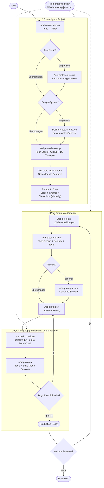

# red · Create Prototyp Project

Ein KI-gestütztes Product Development Framework für [Claude Code](https://claude.ai/code) – von der vagen Idee bis zum getesteten Prototyp, mit Human-in-the-Loop an jedem Schritt.

---

## Was ist das?

Eine Sammlung von Claude Code Commands, die eine vollständige Produktentwicklungs-Pipeline abbilden. Du beschreibst deine Idee in natürlicher Sprache – Claude führt die Pipeline aus, du triffst die Entscheidungen.

### Commands

```
/red-proto:workflow     → Nach jeder Pause: zeigt wo du stehst und was als nächstes zu tun ist

/red-proto:sparring     → Idee schärfen → PRD
/red-proto:test-setup   → Personas + Test-Hypothesen für den Prototyp
/red-proto:dev-setup    → Tech-Stack wählen, Projekt scaffolden, Git/GitHub einrichten
/red-proto:requirements → Feature Specs – einmal pro Feature, für ALLE Features
/red-proto:flows        → Screen-Inventar + verbindliche Transition-Tabelle (einmalig)
/red-proto:ux           → UX-Entscheidungen pro Feature
/red-proto:architect    → Technisches Design + Security + Test-Setup pro Feature
/red-proto:preview      → Abnahme-Screens aus Spec, vor Dev begutachten
/red-proto:dev          → Implementierung (Frontend + Backend parallel, falls nötig)
/red-proto:qa           → Tests + Accessibility + Security + Copy-Drift + Bug-Reports
/red-proto:dev-qa-loop  → Automatischer dev→qa-Loop bis Bugs unter Fix-Schwelle (alternativ zu manuellem Wechsel)
```

Jeder Command ist eigenständig – du kannst über `/red-proto:workflow` jederzeit wiedereinsteigen, er sagt dir wo du stehst. Commands bauen aufeinander auf: jeder liest den Output des vorherigen und ergänzt die gemeinsamen Artefakte.

### Workflow

**Einmalig pro Projekt:**

1. `/red-proto:sparring` – Idee in ein PRD überführen
2. `/red-proto:test-setup` *(empfohlen)* – Personas + Hypothesen für den späteren Prototyp-Test
3. **Design-System anlegen** *(empfohlen)* – `design-system/tokens/` befüllen (Farben, Typo, Spacing), damit `/red-proto:dev-setup` die Tokens in den Stack transportieren kann. Optional: auch Components/Patterns als Markdown ablegen
4. `/red-proto:dev-setup` – Tech-Stack wählen, Projekt scaffolden, DS-Tokens ins Projekt transportieren, Git/GitHub einrichten
5. `/red-proto:requirements` – Feature-Spec pro Feature, bis **alle** Features eine Spec haben
6. `/red-proto:flows` – einmaliges Screen-Inventar + Transitions über alle Features hinweg; wird pro Feature weiter ergänzt

**Pro Feature:**

7. `/red-proto:ux` – UX-Entscheidungen in die Spec; fragt optional nach Wireframes/Lo-Fi/Hi-Fi als Input
8. `/red-proto:architect` – Tech-Design, Security, Test-Setup in die Spec
9. `/red-proto:preview` *(optional)* – Abnahme-Screens erzeugen (Figma-MCP, PNG-Upload oder manuell) und vom User abnehmen lassen, bevor gebaut wird

**QA-Dev-Loop pro Feature** *(mindestens einmal):*

Zwei Wege – manuell oder automatisch:

- **Manuell:**
  10. `/red-proto:dev` – Implementierung, schreibt `context/FEAT-x-dev-handoff.md`
  11. `/red-proto:qa` – **in neuer Session** – Tests + Bug-Reports
  12. Bugs über Schwelle? → zurück zu 10. Keine Bugs → Feature fertig.

- **Automatisch** (empfohlen für längere Loops):
  10. `/red-proto:dev-qa-loop FEAT-X` – orchestriert die Iterationen selbst. In jeder Runde spawnt der Command zwei Subagenten (einen für dev, einen für qa), sammelt die Bugs, berechnet ein Risk-Level und iteriert, bis keine Bugs mehr über der Fix-Schwelle offen sind. Bei zwei aufeinanderfolgenden HIGH-Risk-Runden bietet er einen Exit an. Log liegt unter `context/FEAT-X-loop.log`.

**Wiedereinstieg:** `/red-proto:workflow` funktioniert an jedem Punkt und zeigt dir, wo du im Ablauf stehst.

### Workflow



> **Kontext-Trennung im QA-Dev-Loop:** Beide Wege verhindern Kontext-Akkumulation, aber mit unterschiedlichen Mitteln:
> - **Manuell:** `/red-proto:dev` und `/red-proto:qa` in **getrennten Sessions**. Dev schreibt `context/FEAT-x-dev-handoff.md`, qa liest es in der neuen Session ein.
> - **Automatisch:** `/red-proto:dev-qa-loop` läuft in **einer Session**, spawnt aber pro Iteration einen Dev- und einen QA-**Subagent** mit isoliertem Kontext. Nur die kompakten Rückgabe-Zeilen landen im Haupt-Kontext, nicht die komplette Arbeit.

---

## Voraussetzungen

Pflicht:

- **[Claude Code](https://docs.anthropic.com/claude-code)** – eingerichtet und authentifiziert. Verfügbar als CLI, als Desktop-App (Mac/Windows), als Web-App (claude.ai/code) und als IDE-Extension (VS Code, JetBrains). Wichtig: die Chat-App „Claude" (claude.ai im Browser oder Claude Desktop) ist nicht dasselbe – sie führt keine Slash-Commands aus.
- **[Node.js ≥18](https://nodejs.org/)** mit `npm`/`npx` – für die Framework-Installation (`npx red-proto`).
- **Git** – das Framework commitet nach jedem Schritt, ohne Git funktioniert praktisch nichts.
- **Unix-kompatible Shell** – die Commands nutzen Bash-Syntax (`cat`, `grep`, `mkdir -p`, Heredocs).
  - macOS, Linux: nativ vorhanden
  - **Windows: WSL oder Git Bash** – PowerShell/cmd funktionieren nicht zuverlässig

Optional:

- **[`gh` CLI](https://cli.github.com/)** – nur wenn `/red-proto:dev-setup` ein GitHub-Repo anlegen soll.
- **Figma-MCP-Server** – nur wenn `/red-proto:preview` Screens direkt aus Figma ziehen soll. Ohne MCP lädst du PNGs im Chat hoch oder legst sie manuell ab.
- **Stack-Laufzeit** – Python, Go, Swift etc. werden erst nach der Stack-Wahl in `/red-proto:dev-setup` relevant, nicht vorher.

### Empfohlenes Claude-Modell

- **Für die Installation (`/red-proto:create`) reicht Haiku.** Der Command macht nur mechanisches Kopieren und JSON-Schreiben – dafür brauchst du kein grosses Modell.
- **Für die eigentliche Arbeit mit dem Framework mindestens Opus 4.5.** Die kritisch-denkenden Rollen – Sparring über dein PRD, Requirements-Schärfung, Architektur-Entscheidungen, UX-Abwägungen, QA-Urteile – leben von der Tiefe eines starken Modells. Mit Haiku sparst du Tokens, bekommst aber oberflächliche Ergebnisse, die den ganzen Framework-Aufwand wieder entwerten. Opus 4.5 oder neuer ist teurer, aber die Tokens, die du für ein halbgares Sparring-PRD oder einen flachen Architektur-Entwurf verbrennst, sind am Ende höher.

Modell-Wechsel in Claude Code: `/model` oder in `~/.claude/settings.json` das Feld `"model"`.

---

## Installation

### Schritt 1 – Framework mit `npx red-proto` installieren

```bash
npx red-proto@latest
```

Der Installer fragt interaktiv:

- **Lokal** (`./.claude/` im aktuellen Ordner) → Commands **und** Projektstruktur werden sofort angelegt. **Das reicht. Kein Schritt 2 nötig.**
- **Global** (`~/.claude/`) → Commands sind in allen Projekten verfügbar, aber die Projektstruktur muss separat pro Projekt angelegt werden → **Schritt 2 nötig**.

> **Hinweis:** Nicht global und lokal gleichzeitig installieren – Claude Code zeigt die Commands sonst doppelt an. Der Installer warnt dich, wenn eine andere Installation erkannt wird.

> **Update:** Denselben Befehl erneut ausführen – der Installer erkennt bestehende Installationen.

**Deinstallieren:**

```bash
npx red-proto --uninstall
```

Entfernt alle Commands und Agents – deine Projektdateien (`features/`, `test-setup/`, `prd.md` usw.) bleiben unangetastet.

---

### Schritt 2 – **Nur bei globaler Installation:** `/red-proto:create` pro Projekt ausführen

Überspringen, wenn du in Schritt 1 „Lokal" gewählt hast – dann ist alles bereits angelegt.

Bei globaler Installation legst du die Projektstruktur pro Projekt einmal an:

```bash
mkdir mein-projekt && cd mein-projekt
claude
```

Dann in Claude Code:

```
/red-proto:create
```

`/red-proto:create` richtet denselben Zustand her, den du bei lokaler Installation bekommst: `.claude/` mit Commands und Agents plus `design-system/`. Alle weiteren Ordner (`test-setup/`, `features/`, `flows/`, `bugs/`, `context/`, `docs/`, dein Projektverzeichnis) legen die jeweiligen Commands bei Bedarf selbst an.

#### Was dich während `/red-proto:create` erwartet

Claude Code wird dich zweimal um Bestätigung bitten. Beides ist **normales Verhalten**, keine Fehlermeldung – Claude Code fragt grundsätzlich einmal nach, bevor es in ein neues Verzeichnis schreibt oder eine Permissions-Datei anlegt:

1. **Verzeichnis anlegen** – Claude Code fragt, ob es in `.claude/commands/red-proto` schreiben darf. Wähle „Yes, and always allow access to commands/ from this project" und du hast für die Session Ruhe.

2. **`.claude/settings.json` erstellen** – legt projektlokale Terminal-Permissions fest, damit du nicht bei jedem Bash-/Git-/Node-Befehl erneut zustimmen musst. Der genaue Inhalt wird dir vor dem Zustimmen gezeigt.

Beide Aktionen wirken **ausschließlich projektlokal**. Deine globale `~/.claude/settings.json` bleibt unangetastet.

---

### Loslegen

```
/red-proto:sparring
```

---

## Was wird installiert?

Nach dem Setup hat dein Projekt folgende Struktur:

```
./
  .claude/
    commands/               ← Alle Pipeline-Commands
    agents/                 ← Sub-Agents (frontend-developer, ux-reviewer, ...)
  design-system/
    README.md               ← Erklärt Struktur-Empfehlungen (frei wählbar)
    [dein Content]          ← Tokens, Komponenten, Patterns – Struktur nach Wahl
  [prd.md]                  ← /red-proto:sparring
  [test-setup/]             ← /red-proto:test-setup
    personas.md
    hypotheses.md
  [features/]               ← /red-proto:requirements, ux, architect, dev, qa
    STATUS.md
    [FEAT-X-name.md]        ← Akkumulative Feature-Spec
    [FEAT-X-name/screens/]  ← /red-proto:preview (optional, Abnahme-Screens)
  [flows/]                  ← /red-proto:flows
  [bugs/]                   ← /red-proto:qa (Bug-Reports, -fixed.md nach Fix)
  [context/]                ← /red-proto:dev, /red-proto:dev-qa-loop
  [docs/]                   ← /red-proto:qa (produktfähigkeiten, releases)
  [projektverzeichnis/]     ← /red-proto:dev-setup (Name bei Scaffold gewählt)
  [project-config.md]       ← /red-proto:dev-setup
```

> `[eckige Klammern]` bedeutet: wird erst vom genannten Command angelegt, sobald er das erste Mal läuft. Name oder innere Struktur kann sich je nach User-Wahl unterscheiden. Beim Start nach der Installation ist nur `.claude/` und `design-system/` sichtbar – alles andere wächst mit dem Projekt.

Details zu allen File-Formaten: [ARTIFACT_SCHEMA.md](./ARTIFACT_SCHEMA.md)

---

## Das Design System

Für einen Prototypen ist ein eigenes Design-System **nicht zwingend**. Du entscheidest dich **vor `/red-proto:dev-setup`** für einen von zwei Wegen – sie schließen sich aus:

### Weg 1 – Eigenes Design-System als Markdown

Du legst Tokens (Farben, Typo, Spacing, Shadows, …), Komponenten und Patterns in `design-system/` ab, bevor `/red-proto:dev-setup` läuft. Die Ordner-Struktur ist frei wählbar – die Agents lesen alle `*.md`-Dateien rekursiv. Beispiele stehen in `design-system/README.md`.

`/red-proto:dev-setup` transportiert die Tokens dann automatisch ins stack-spezifische Format (Tailwind-Config, CSS-Variablen, SwiftUI-Extensions, …) und empfiehlt einen Stack **ohne gestylte UI-Library**. Der Frontend-Agent baut eigene Komponenten passend zum DS.

### Weg 2 – Gestylte UI-Library im Tech-Stack

Du lässt `design-system/` leer (nur die mitgelieferte `README.md`). `/red-proto:dev-setup` darf dann eine gestylte UI-Library empfehlen – shadcn/ui für Next.js/Vite, MUI für React-Enterprise, Chakra, Vuetify für Vue, etc. Look & Feel kommt aus der Library, der Frontend-Agent nutzt ausschließlich Library-Komponenten.

### Entweder-Oder, hart

Beides zusammen geht **nicht**. Wenn in `project-config.md` eine `UI-Library: [Name]` gesetzt ist und zusätzlich Dateien in `design-system/` liegen, melden die Agents einen Konflikt und fragen nach – sie raten nicht.

Headless-Primitives ohne Styling (Radix Primitives, React Aria, Headless UI) zählen **nicht** als UI-Library. Sie sind Infrastruktur für Accessibility und Keyboard-Handling und dürfen parallel zu Weg 1 genutzt werden.

### Umswitchen später

Möglich, aber nicht automatisch:

- **Von Weg 2 zu Weg 1:** DS in `design-system/` befüllen → `UI-Library: keine` in `project-config.md` setzen → `/red-proto:dev-setup` Phase 5b neu triggern (für Token-Transport).
- **Von Weg 1 zu Weg 2:** DS-Dateien außer README entfernen → Library-Name in `project-config.md` eintragen → Library installieren, DS-Imports im Code entfernen.

### DS-Komponenten-Zustände (nur Weg 1)

| Status | Bedeutung |
|--------|-----------|
| `DS-konform` | Implementiert nach DS-Spec – keine Anpassung nötig |
| `Tokens-Build` | Nutzt DS-Tokens, aber keine fertige Komponente im DS vorhanden – Agent baut selbst |
| `Hypothesen-Test` | Bewusstes Abweichen vom DS – UX-Entscheidung mit Begründung |

---

## Empfohlene Skills

Das Framework läuft ohne zusätzliche Skills, nutzt sie aber wenn vorhanden:

| Skill | Genutzt von | Effekt |
|-------|-------------|--------|
| `ui-ux-pro-max` | `/red-proto:ux`, `ux-reviewer` Agent | Deutlich bessere UX-Qualität |
| `frontend-design` | `frontend-developer` Agent | Bessere Component-Implementierung |

Skills werden in Claude Code unter **Einstellungen → Skills** installiert.

---

## Framework-Philosophie

**Human-in-the-Loop:** Kein Agent geht alleine weiter – jeder Schritt braucht eine explizite Bestätigung.

**Akkumulativ statt überschreibend:** Jeder Agent ergänzt seinen Abschnitt im Feature-File, bestehende Abschnitte bleiben erhalten.

**Session-Trennung:** `/red-proto:dev` und `/red-proto:qa` laufen bewusst in getrennten Sessions. Das verhindert Kontext-Akkumulation und hält den Token-Verbrauch pro Session niedrig. Das Handoff-File in `context/` ist die Brücke.

**Flows als Navigationsvertrag:** `/red-proto:flows` erstellt eine verbindliche Transition-Tabelle, die UX und Developer als gemeinsame Quelle der Wahrheit nutzen. Undokumentierte Transitions werden gemeldet, nicht stillschweigend implementiert.

**Audit-Trail:** Bugs werden nicht gelöscht, sondern zu `-fixed.md` umbenannt.

**SemVer:** Automatisches Versioning – PATCH bei Bug-Fixes, MINOR bei neuen Features, MAJOR bei intentionalem Release.

---

## Lizenz

MIT
