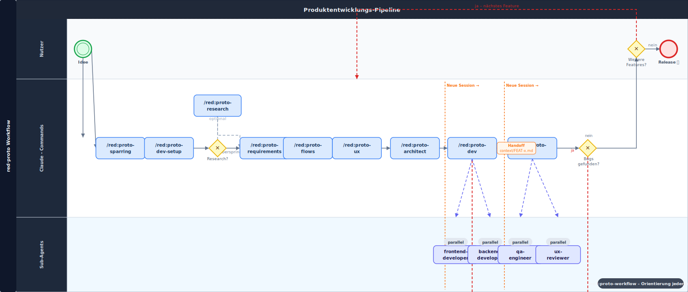

# red · Create Prototyp Project

Ein KI-gestütztes Product Development Framework für [Claude Code](https://claude.ai/code) – von der vagen Idee bis zum getesteten Prototyp, mit Human-in-the-Loop an jedem Schritt.

---

## Workflow



> Maschinenlesbare BPMN 2.0 Datei: [workflow.bpmn](docs/workflow.bpmn) – öffenbar in [Camunda Modeler](https://camunda.com/download/modeler/) oder [bpmn.io](https://bpmn.io)

**Faustregel:** Alles bis `/red:proto-flows` machst du einmal für dein Projekt. Ab `/red:proto-ux` wiederholst du den Loop für jedes Feature. `proto-dev` und `proto-qa` laufen in **getrennten Sessions** – `proto-dev` schreibt am Ende ein Handoff-File, das `proto-qa` in der neuen Session einliest.

---

## Was ist das?

Eine Sammlung von Claude Code Commands und Agents, die eine vollständige Produktentwicklungs-Pipeline abbilden. Du arbeitest mit natürlicher Sprache – Claude führt die Pipeline aus, du triffst die Entscheidungen.

```
/red:proto-workflow     → Nach jeder Pause: zeigt exakt wo du stehst und was als nächstes zu tun ist

/red:proto-sparring     → Idee schärfen → PRD
/red:proto-dev-setup    → Tech-Stack wählen, Projekt scaffolden, Git/GitHub einrichten
/red:proto-research     → Problem Statement Map + Personas (optional)
/red:proto-requirements → Feature Specs – einmal pro Feature, für ALLE Features
                          ↓ wenn ALLE Features Specs haben:
/red:proto-flows        → Screen-Inventar + verbindliche Transition-Tabelle (einmalig)
/red:proto-ux           → UX-Entscheidungen – einmal pro Feature

dann pro Feature (Build-Loop bis QA grün):
/red:proto-architect    → Technisches Design + Security + Test-Setup
/red:proto-dev          → Implementierung (Frontend + Backend, parallel falls nötig)
                          └── schreibt context/FEAT-x-dev-handoff.md am Ende
/red:proto-qa           → Tests, Accessibility, Security, Bug-Loop bis Production-Ready
                          └── Bugs? → neue Session → /red:proto-dev → /red:proto-qa
```

Jeder Command ist eigenständig – du kannst an jedem Punkt einsteigen oder aufhören. Die Commands bauen aber aufeinander auf: jeder liest den Output des vorherigen und ergänzt die gemeinsamen Artefakte.

---

## Voraussetzungen

- [Claude Code CLI](https://docs.anthropic.com/claude-code) installiert und eingerichtet
- [`gh` CLI](https://cli.github.com/) (nur für GitHub-Setup in `/red:proto-dev-setup`)
- Node.js, Python oder ähnliches – je nach gewähltem Tech-Stack

---

## Installation – zwei Schritte, zwei verschiedene Dinge

> **Wichtig:** Es gibt zwei Schritte, die unterschiedliche Zwecke haben. Beide sind nötig.

### Schritt 1 – `npx red-proto` installiert das Framework auf deinem Computer

Macht die `/red:proto-*` Commands in Claude Code verfügbar. Einmalig pro Computer ausführen.

```bash
npx red-proto@latest
```

Der Installer fragt interaktiv:
- **Global** (`~/.claude/`) → Commands in allen Projekten verfügbar
- **Lokal** (`./.claude/`) → nur im aktuellen Verzeichnis

> **Hinweis:** Nicht global und lokal gleichzeitig installieren – Claude Code zeigt die Commands sonst doppelt an. Der Installer warnt dich, wenn eine andere Installation erkannt wird.

> **Update:** Denselben Befehl erneut ausführen – der Installer erkennt bestehende Installationen.

**Deinstallieren:**

```bash
npx red-proto --uninstall
```

Entfernt alle Commands und Agents – deine Projektdateien (`features/`, `research/`, `prd.md` usw.) bleiben unangetastet.

**Option B – Manuell via Git (falls kein npx):**

```bash
git clone https://github.com/eltuctuc/red-create-prototyp-project.git ~/.claude/templates/red-create-prototyp-project && \
cp ~/.claude/templates/red-create-prototyp-project/commands/red\:proto.md ~/.claude/commands/
```

---

### Schritt 2 – `/red:proto` richtet ein einzelnes Projekt ein

> **Diesen Schritt musst du für jedes neue Projekt wiederholen.**

`npx` installiert nur die Commands. `/red:proto` baut die Projektstruktur auf:

- legt `research/`, `features/`, `flows/`, `bugs/`, `docs/`, `context/` an
- kopiert das Design System mit Index ins Projekt
- erstellt `project-config.md` und `features/STATUS.md` als Basis für alle Agents

```bash
mkdir mein-projekt && cd mein-projekt
claude
```

Dann in Claude Code:

```
/red:proto
```

**Danach loslegen:**

```
/red:proto-sparring
```

---

### Kurzübersicht: Was macht was?

| Befehl | Wann | Was passiert |
|--------|------|--------------|
| `npx red-proto@latest` | Einmalig pro Computer | Installiert Commands in `~/.claude/` (global) oder `./.claude/` (lokal) |
| `/red:proto` | Einmalig pro Projekt | Legt Projektstruktur an, kopiert Design System |
| `/red:proto-sparring` | Start jedes Projekts | Erste Anlaufstelle – Idee zu PRD |
| `/red:proto-workflow` | Nach jeder Session-Pause | Zeigt wo du stehst, was als nächstes kommt |

---

## Was wird installiert?

Nach dem Setup hat dein Projekt folgende Struktur:

```
./
  .claude/
    commands/          ← Alle Pipeline-Commands (red:proto-sparring, red:proto-dev, ...)
    agents/            ← Sub-Agents (frontend-developer, ux-reviewer, ...)
  design-system/       ← Neutrales Design System (Tokens, Komponenten, Patterns)
    INDEX.md           ← Kompakte Übersicht – Agents laden von hier selektiv
    tokens/            ← Farben, Typografie, Spacing, Shadows, Motion
    components/        ← Button, Input, Card, ...
    patterns/          ← Navigation, Formulare, Feedback, Datendarstellung
    screens/           ← Platzhalter für Figma-Exports
  features/            ← Akkumulatives Feature-File (alle Agents ergänzen hier)
    STATUS.md          ← Zentraler Status-Index aller Features
  flows/               ← Screen-Inventar + verbindliche Transition-Tabellen
  research/            ← User Research Ergebnisse
  bugs/                ← Bug-Reports (werden nicht gelöscht, sondern zu -fixed.md)
  context/             ← Session-Handoffs (dev → qa Übergaben)
  docs/                ← Produktfähigkeiten + Release-Historie
  prd.md               ← Product Requirements Document (erstellt von /red:proto-sparring)
  project-config.md    ← Tech-Stack, Pfade, Versionierung
```

Details zu allen File-Formaten: [ARTIFACT_SCHEMA.md](./ARTIFACT_SCHEMA.md)

---

## Das Design System

Das Framework bringt ein **neutrales Design System** mit – als Ausgangspunkt, keine Pflicht. Du kannst es schrittweise befüllen oder durch ein bestehendes ersetzen.

Agents laden das Design System **selektiv**: zuerst `design-system/INDEX.md` (kompakte Übersicht), dann nur die Komponenten- und Token-Files die für das aktuelle Feature tatsächlich gebraucht werden. Das spart erheblich Kontext.

**Drei Zustände pro Komponente:**

| Status | Bedeutung |
|--------|-----------|
| `DS-konform` | Implementiert nach Spec – keine Anpassung nötig |
| `Tokens-Build` | Nutzt DS-Tokens, aber keine fertige Komponente vorhanden – Agent baut selbst |
| `Hypothesen-Test` | Bewusstes Abweichen – UX-Entscheidung mit Begründung |

---

## Empfohlene Skills

Das Framework läuft ohne zusätzliche Skills, nutzt sie aber wenn vorhanden:

| Skill | Genutzt von | Effekt |
|-------|-------------|--------|
| `ui-ux-pro-max` | `/red:proto-ux`, `ux-reviewer` Agent | Deutlich bessere UX-Qualität |
| `frontend-design` | `frontend-developer` Agent | Bessere Component-Implementierung |
| `neon-postgres` | `backend-developer` Agent | Nur bei Neon-Datenbankstack |
| `atlassian:spec-to-backlog` | `/red:proto-requirements` | Direkt in Jira schreiben |

Skills werden in Claude Code unter **Einstellungen → Skills** installiert.

---

## Framework-Philosophie

**Human-in-the-Loop:** Kein Agent geht alleine weiter – jeder Schritt braucht eine explizite Bestätigung.

**Akkumulativ statt überschreibend:** Jeder Agent ergänzt seinen Abschnitt im Feature-File, bestehende Abschnitte bleiben erhalten.

**Session-Trennung:** `proto-dev` und `proto-qa` laufen bewusst in getrennten Sessions. Das verhindert Kontext-Akkumulation und hält den Token-Verbrauch pro Session niedrig. Das Handoff-File in `context/` ist die Brücke.

**Flows als Navigationsvertrag:** `/red:proto-flows` erstellt eine verbindliche Transition-Tabelle, die UX und Developer als gemeinsame Quelle der Wahrheit nutzen. Undokumentierte Transitions werden gemeldet, nicht stillschweigend implementiert.

**Audit-Trail:** Bugs werden nicht gelöscht, sondern zu `-fixed.md` umbenannt.

**SemVer:** Automatisches Versioning – PATCH bei Bug-Fixes, MINOR bei neuen Features, MAJOR bei intentionalem Release.

---

## Lizenz

MIT
