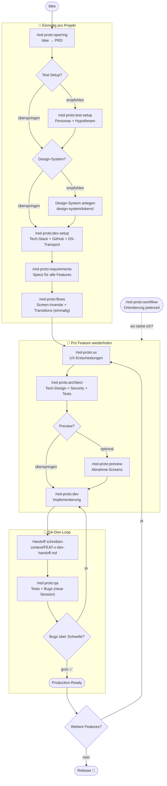

# red · Create Prototyp Project

Ein KI-gestütztes Product Development Framework für [Claude Code](https://claude.ai/code) – von der vagen Idee bis zum getesteten Prototyp, mit Human-in-the-Loop an jedem Schritt.

---

## Was ist das?

Eine Sammlung von Claude Code Commands, die eine vollständige Produktentwicklungs-Pipeline abbilden. Du beschreibst deine Idee in natürlicher Sprache – Claude führt die Pipeline aus, du triffst die Entscheidungen.

```
/red-proto:workflow     → Nach jeder Pause: zeigt exakt wo du stehst und was als nächstes zu tun ist

/red-proto:sparring     → Idee schärfen → PRD
/red-proto:test-setup   → Personas + Test-Hypothesen für den Prototyp (empfohlen)
Design-System anlegen   → design-system/tokens/ befüllen (empfohlen vor dev-setup)
/red-proto:dev-setup    → Tech-Stack wählen, Projekt scaffolden, DS-Tokens transportieren
/red-proto:requirements → Feature Specs – einmal pro Feature, für ALLE Features
                          ↓ wenn ALLE Features Specs haben:
/red-proto:flows        → Screen-Inventar + verbindliche Transition-Tabelle (einmalig)
/red-proto:ux           → UX-Entscheidungen – fragt optional nach Wireframes/Lo-Fi/Hi-Fi

dann pro Feature (Build-Loop bis QA grün):
/red-proto:architect    → Technisches Design + Security + Test-Setup
/red-proto:preview      → Optional: Abnahme-Screens aus Spec, vor Dev begutachten
/red-proto:dev          → Implementierung (Frontend + Backend, parallel falls nötig)
                          └── schreibt context/FEAT-x-dev-handoff.md am Ende
/red-proto:qa           → Tests, Accessibility, Security, Copy-Drift, Bug-Loop
                          └── Bugs? → neue Session → /red-proto:dev → /red-proto:qa
```

Jeder Command ist eigenständig – du kannst an jedem Punkt einsteigen oder aufhören. Die Commands bauen aufeinander auf: jeder liest den Output des vorherigen und ergänzt die gemeinsamen Artefakte.

### Workflow



**Faustregel:** Alles bis `/red-proto:flows` machst du einmal für dein Projekt. Ab `/red-proto:ux` wiederholst du den Loop für jedes Feature. `/red-proto:dev` und `/red-proto:qa` laufen in **getrennten Sessions** – `/red-proto:dev` schreibt am Ende ein Handoff-File, das `/red-proto:qa` in der neuen Session einliest.

---

## Voraussetzungen

Pflicht:

- **[Claude Code](https://docs.anthropic.com/claude-code)** (CLI oder IDE-Extension) – eingerichtet und authentifiziert. **Claude Desktop reicht nicht**, weil es keine Slash-Commands ausführt.
- **[Node.js ≥18](https://nodejs.org/)** mit `npm`/`npx` – für die Framework-Installation (`npx red-proto`).
- **Git** – das Framework commitet nach jedem Schritt, ohne Git funktioniert praktisch nichts.
- **Unix-kompatible Shell** – die Commands nutzen Bash-Syntax (`cat`, `grep`, `mkdir -p`, Heredocs).
  - macOS, Linux: nativ vorhanden
  - **Windows: WSL oder Git Bash** – PowerShell/cmd funktionieren nicht zuverlässig

Optional:

- **[`gh` CLI](https://cli.github.com/)** – nur wenn `/red-proto:dev-setup` ein GitHub-Repo anlegen soll.
- **Figma-MCP-Server** – nur wenn `/red-proto:preview` Screens direkt aus Figma ziehen soll. Ohne MCP lädst du PNGs im Chat hoch oder legst sie manuell ab.
- **Stack-Laufzeit** – Python, Go, Swift etc. werden erst nach der Stack-Wahl in `/red-proto:dev-setup` relevant, nicht vorher.

---

## Installation

### Schritt 1 – Framework mit `npx red-proto` installieren

```bash
npx red-proto@latest
```

Der Installer fragt interaktiv:

- **Lokal** (`./.claude/` im aktuellen Ordner) → Commands **und** Projektstruktur werden sofort angelegt. **Das reicht. Kein Schritt 2 nötig.**
- **Global** (`~/.claude/`) → Commands sind in allen Projekten verfügbar, aber die Projektstruktur muss separat pro Projekt angelegt werden → **Schritt 2 nötig**.

> **Hinweis:** Nicht global und lokal gleichzeitig installieren – Claude Code zeigt die Commands sonst doppelt an. Der Installer warnt dich, wenn eine andere Installation erkannt wird.

> **Update:** Denselben Befehl erneut ausführen – der Installer erkennt bestehende Installationen.

**Deinstallieren:**

```bash
npx red-proto --uninstall
```

Entfernt alle Commands und Agents – deine Projektdateien (`features/`, `test-setup/`, `prd.md` usw.) bleiben unangetastet.

---

### Schritt 2 – **Nur bei globaler Installation:** `/red-proto:create` pro Projekt ausführen

Überspringen, wenn du in Schritt 1 „Lokal" gewählt hast – dann ist alles bereits angelegt.

Bei globaler Installation legst du die Projektstruktur pro Projekt einmal an:

```bash
mkdir mein-projekt && cd mein-projekt
claude
```

Dann in Claude Code:

```
/red-proto:create
```

`/red-proto:create` legt dieselben Ordner (`test-setup/`, `features/`, `flows/`, `bugs/`, `docs/`, `context/`, `design-system/`) an, die bei lokaler Installation sofort entstehen.

---

### Loslegen

```
/red-proto:sparring
```

---

## Was wird installiert?

Nach dem Setup hat dein Projekt folgende Struktur:

```
./
  .claude/
    commands/          ← Alle Pipeline-Commands (red-proto:sparring, red-proto:dev, ...)
    agents/            ← Sub-Agents (frontend-developer, ux-reviewer, ...)
  design-system/       ← Optional: Tokens/Komponenten/Patterns als Markdown
    tokens/            ← Farben, Typografie, Spacing, Shadows, Motion
    components/        ← Button, Input, Card, ...
    patterns/          ← Navigation, Formulare, Feedback, Datendarstellung
    screens/           ← Referenz-Screens (Mockups globaler Patterns)
  features/
    STATUS.md          ← Zentraler Status-Index aller Features
    FEAT-1-name.md     ← Feature-Spec (erstellt von /red-proto:requirements,
                         akkumulativ ergänzt von ux, architect, dev, qa)
    FEAT-1-name/
      screens/         ← Optional: Abnahme-Screens (von /red-proto:preview)
        S-10-*.png
        index.md       ← Metadaten der Abnahme-Screens
  flows/               ← Screen-Inventar + verbindliche Transition-Tabellen
  test-setup/          ← Personas + Test-Hypothesen für Prototyp-Tests
  bugs/                ← Bug-Reports (werden nicht gelöscht, sondern zu -fixed.md)
  context/             ← Session-Handoffs (dev → qa Übergaben)
  docs/                ← Produktfähigkeiten + Release-Historie
  prd.md               ← Product Requirements Document (erstellt von /red-proto:sparring)
  project-config.md    ← Tech-Stack, Pfade, Versionierung
```

Details zu allen File-Formaten: [ARTIFACT_SCHEMA.md](./ARTIFACT_SCHEMA.md)

---

## Das Design System

Für einen Prototypen ist ein eigenes Design-System **nicht zwingend**. Du hast zwei Wege:

1. **Eigenes Design-System als Markdown** – du legst in `design-system/tokens/`, `components/` und `patterns/` deine Vorgaben ab, bevor `/red-proto:dev-setup` läuft. Der Dev-Setup transportiert die Tokens dann automatisch in das stack-spezifische Format (Tailwind-Config, CSS-Variablen, SwiftUI-Extensions, …).
2. **UI-Library im Tech-Stack** – z.B. shadcn/ui, Material UI, Vuetify. Look & Feel kommt aus der Library, `design-system/` bleibt leer und wird im Dev-Setup ignoriert.

> **Geplant für einen späteren Release:** Das Framework bringt aktuell noch einen vorbefüllten, neutralen Design-System-Ordner mit – gedacht als Starter. In der Praxis kollidiert das mit Weg 2, weil Agents blind das Markdown-DS bevorzugen, obwohl eine UI-Library installiert ist. In v0.20 soll der Installer nur noch den leeren Ordner anlegen, und die Agents sollen explizit Library-First arbeiten, wenn eine vorhanden ist.

Für Weg 1 gilt: Agents laden das Design-System **selektiv** – zuerst den Index, dann nur die konkret benötigten Komponenten- und Token-Files.

**Drei Zustände pro Komponente** (bei Weg 1 relevant):

| Status | Bedeutung |
|--------|-----------|
| `DS-konform` | Implementiert nach Spec – keine Anpassung nötig |
| `Tokens-Build` | Nutzt DS-Tokens, aber keine fertige Komponente vorhanden – Agent baut selbst |
| `Hypothesen-Test` | Bewusstes Abweichen – UX-Entscheidung mit Begründung |

---

## Empfohlene Skills

Das Framework läuft ohne zusätzliche Skills, nutzt sie aber wenn vorhanden:

| Skill | Genutzt von | Effekt |
|-------|-------------|--------|
| `ui-ux-pro-max` | `/red-proto:ux`, `ux-reviewer` Agent | Deutlich bessere UX-Qualität |
| `frontend-design` | `frontend-developer` Agent | Bessere Component-Implementierung |
| `neon-postgres` | `backend-developer` Agent | Nur bei Neon-Datenbankstack |
| `atlassian:spec-to-backlog` | `/red-proto:requirements` | Direkt in Jira schreiben |

Skills werden in Claude Code unter **Einstellungen → Skills** installiert.

---

## Framework-Philosophie

**Human-in-the-Loop:** Kein Agent geht alleine weiter – jeder Schritt braucht eine explizite Bestätigung.

**Akkumulativ statt überschreibend:** Jeder Agent ergänzt seinen Abschnitt im Feature-File, bestehende Abschnitte bleiben erhalten.

**Session-Trennung:** `/red-proto:dev` und `/red-proto:qa` laufen bewusst in getrennten Sessions. Das verhindert Kontext-Akkumulation und hält den Token-Verbrauch pro Session niedrig. Das Handoff-File in `context/` ist die Brücke.

**Flows als Navigationsvertrag:** `/red-proto:flows` erstellt eine verbindliche Transition-Tabelle, die UX und Developer als gemeinsame Quelle der Wahrheit nutzen. Undokumentierte Transitions werden gemeldet, nicht stillschweigend implementiert.

**Audit-Trail:** Bugs werden nicht gelöscht, sondern zu `-fixed.md` umbenannt.

**SemVer:** Automatisches Versioning – PATCH bei Bug-Fixes, MINOR bei neuen Features, MAJOR bei intentionalem Release.

---

## Lizenz

MIT
